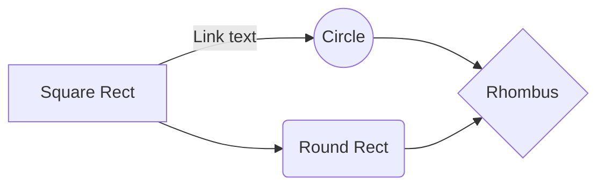

# PUSH SWAP 

### 1 - Algorithm
#### Parser
- check number of arguments
- check the validity of arguments
- check if double number exist
- Parse all arguments into a doubly linked list
- Create a structure name t_stack which always knows the head and the tail of the list

#### Normalisation
- Do a quicksort algorithm to sort a int tab
- With this sorted tab, put the good id to all link of the list

### Sort
#### Sort for 3 args

| A | B | C | Results |
|---|---|---|---------|
| 1 | 2 | 3 |  None   |
| 1 | 3 | 2 | rra-sa  |
| 2 | 3 | 1 |   rra   |
| 2 | 1 | 3 |   sa    |
| 3 | 1 | 2 |   ra    |
| 3 | 2 | 1 | ra - sa |
